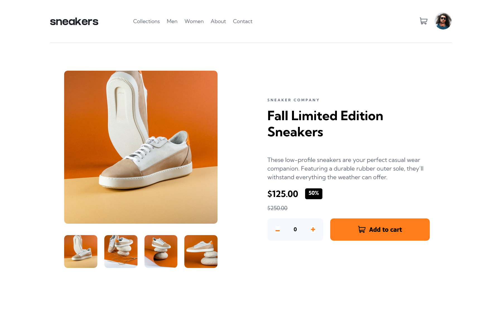

# Frontend Mentor - E-commerce product page solution

This is a solution to the [E-commerce product page challenge on Frontend Mentor](https://www.frontendmentor.io/challenges/ecommerce-product-page-UPsZ9MJp6). Frontend Mentor challenges help you improve your coding skills by building realistic projects.

## Table of contents

- [Overview](#overview)
  - [Screenshot](#screenshot)
  - [Links](#links)
- [My process](#my-process)
  - [Built with](#built-with)
  - [What I learned](#what-i-learned)
  - [Continued development](#continued-development)
  - [Useful resources](#useful-resources)
- [Author](#author)
- [Acknowledgments](#acknowledgments)

## Overview

### Screenshot




### Links

- Solution URL: [Solution here](https://github.com/MariaCMontO/ecommerce-product-page-cmo)

## My process

### Built with

- Semantic HTML5 markup
- CSS custom properties
- Flexbox
- Grid
- JavaScript

### What I learned

With this project, I learned how to include accesibily. It's important to include atributes like aria-label in buttons to make clear the use of those. In this project, the implementation of JS was harder, because it simulated a store, for that reason, become the cart functional and all the in interface in general was a completely chanllenge.

```js
const nextPreviousButtons = document.querySelectorAll('.next-image-button, .previous-image-button')
nextPreviousButtons.forEach((button) => {
    button.addEventListener('click', () => {
        changeImage(button)
    })
})

function changeImage(button) {
    const imagesArray = [
        '/images/image-product-1.jpg',
        '/images/image-product-2.jpg',
        '/images/image-product-3.jpg',
        '/images/image-product-4.jpg'
    ];

    const parentElement = button.parentElement
    const currentImg = Array.from((parentElement.querySelector('.product-image').children))[0]
    const currentImage = currentImg.getAttribute('src')
    const index = imagesArray.indexOf(currentImage)

    const direction = button.value === '+' ? 1 : -1;
    let newIndex = index + direction;

    if (newIndex >= imagesArray.length) {
        newIndex = 0
    } else if (newIndex < 0) {
        newIndex = imagesArray.length - 1
    }

    currentImg.src = imagesArray[newIndex]
}
```

### Continued development

I definitely want to keep developing interfaces with JavaScript functions, in order to make them more interactive.

### Useful resources

## Author

- Frontend Mentor - [@MariaCMontO](https://github.com/MariaCMontO)


## Acknowledgments